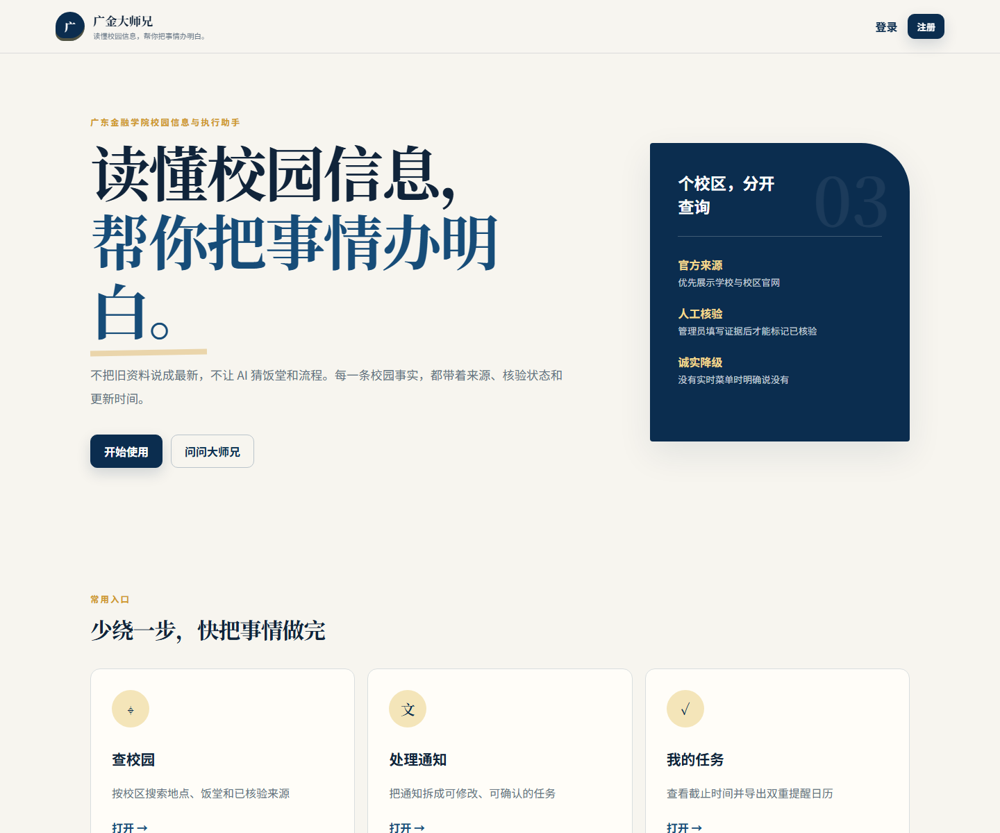
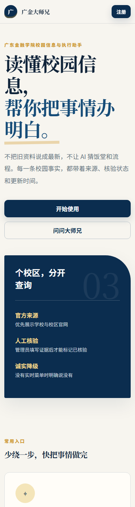

# 广金大师兄

> 读懂校园信息，帮你把事情办明白。

“广金大师兄”是面向广东金融学院学生的全栈校园信息与事项执行网站。正式入口已从 Streamlit 迁移为 React + FastAPI + PostgreSQL；旧实现完整保存在 `legacy_streamlit/`，不再是生产入口。

## 产品截图





## 在线网站

公开网站与管理后台尚未生成。用户已说明 Render 网页端已登录，但当前终端没有可用的 Render CLI/API 会话、目标服务和生产数据库信息，因此本轮没有伪造公网地址。代码、容器与迁移均已准备好；`localhost` 仅用于本地验证，不作为线上地址。

## 核心功能

- 邮箱注册、登录、退出、自动刷新 Cookie、修改资料/密码与删除账户。
- 广州校本部、肇庆校区、清远校区独立筛选；地点搜索、来源卡片、学生纠错，以及配置凭据后启用的真实高德 JS 地图、地理编码、步行路线和外部导航。
- 饭堂、楼层、档口、常见餐品及核验状态；没有可靠今日菜单时明确返回“无实时数据”。
- TXT/PDF 通知解析、可编辑预览、确认后批量入库，图片 OCR 明确标记为未启用。
- 任务增删改查、今日/本周/临期/逾期/完成视图、批量操作与 `Asia/Shanghai` ICS 双提醒。
- Agent 采用 observe → classify → plan → execute → verify → confirm → remember → respond 管线，具备 15 类意图、41 个注册工具、多轮历史、工具/来源卡片、失败重试与明确模型错误。
- 用户可设置希望大师兄使用的称呼、称呼风格和常用地点；校园事实与通用学习建议使用不同回答边界。
- 校园办事流程可检索并在确认后保存为任务；管理员可维护带来源、时效和核验状态的校园知识资料。
- 基于角色的管理后台：用户、校区、地点、地图、饭堂、档口、流程、来源、纠错、陈旧数据、日志和导入导出。

## 技术架构

```text
Browser
  └─ React 19 + TypeScript + Vite + Nginx
       └─ /api (HttpOnly Cookie)
            └─ FastAPI + Pydantic + SQLAlchemy + Alembic
                 ├─ Auth / Agent pipeline / Tools / Tasks / Campus / Map / Admin
                 └─ PostgreSQL 16（测试可用 SQLite）
```

聊天使用后端统一模型客户端调用 `deepseek-v4-flash`，意图 JSON 通过 Pydantic 校验，并把最近对话历史传给模型。未配置、认证失败、限流或超时时返回明确错误，不用固定文本冒充模型回答。校园事实始终来自数据库工具，不让模型补写地点、电话、档口、菜单或制度。

## 目录

```text
frontend/            React 网站、响应式样式、前端测试、Nginx 与 Dockerfile
backend/app/         FastAPI、模型、服务、Agent、鉴权与 API
backend/migrations/  Alembic 数据库迁移
backend/tests/       API、权限、Agent、ICS 与端到端持久化测试
data/campuses/       三校区历史/待核验种子数据
data/import_templates/ CSV、JSON、GeoJSON 模板
docs/                架构、API、数据库、安全、部署和操作手册
legacy_streamlit/    只作追溯的旧版 Streamlit 实现
```

## 本地运行（不使用 Docker）

后端：

```powershell
python -m venv venv
.\venv\Scripts\python.exe -m pip install -r backend\requirements.txt -r backend\requirements-dev.txt
Copy-Item .env.example .env
Set-Location backend
..\venv\Scripts\alembic.exe upgrade head
..\venv\Scripts\uvicorn.exe app.main:app --reload
```

前端（另一个终端）：

```powershell
Set-Location frontend
npm ci
npm run dev
```

开发后端默认可用 SQLite；需要和生产一致时使用 Docker PostgreSQL。

## Docker 一键启动

```powershell
Copy-Item .env.example .env
# 修改 .env 中所有密码与 Secret
docker compose up --build
```

前端默认监听 `http://localhost:8080`，后端健康检查为 `http://localhost:8000/health`（容器内），就绪检查为 `/ready`。后端容器启动时自动执行 `alembic upgrade head`。

## 环境变量

必需生产变量：`DATABASE_URL`、`JWT_SECRET`、`REFRESH_TOKEN_SECRET`、`FRONTEND_URL`、`BACKEND_URL`、`ALLOWED_ORIGINS`、`COOKIE_SECURE`、`ADMIN_BOOTSTRAP_EMAIL`、`ADMIN_BOOTSTRAP_PASSWORD`。启用聊天还必须配置 `DEEPSEEK_API_KEY`；`DEEPSEEK_BASE_URL` 默认 `https://api.deepseek.com`，`DEEPSEEK_MODEL` 默认 `deepseek-v4-flash`。启用真实地图需要浏览器公开的 `VITE_AMAP_JS_KEY`，以及仅后端可见的 `AMAP_SECURITY_CODE`、`AMAP_WEBSERVICE_KEY`；浏览器通过同源安全代理使用安全码。

生产环境会拒绝弱 JWT Secret 和不安全 Cookie。DeepSeek Key 只在后端读取，不进入浏览器、数据库、日志或 Git。完整说明见 [安全文档](docs/SECURITY.md)。

## 数据库迁移

```powershell
Set-Location backend
..\venv\Scripts\alembic.exe upgrade head
..\venv\Scripts\alembic.exe current
```

新增模型后使用 `alembic revision --autogenerate -m "..."`，人工检查迁移再提交。正式表结构与删除语义见 [数据库文档](docs/DATABASE.md)。

## 测试

```powershell
Set-Location backend
..\venv\Scripts\python.exe -m pytest -q
Set-Location ..\frontend
npm run typecheck
npm run lint
npm test
npm run build
# 前后端已经启动时，使用本机 Edge 跑完整浏览器流程
npm run test:e2e
```

当前本地结果（2026-08-04）：后端 56 项通过、前端 20 项通过、Playwright 端到端 1 条完整流程通过，ESLint、TypeScript 与 Vite 生产构建通过。端到端测试由真实 FastAPI 请求本地 OpenAI 协议 Mock 服务，不调用付费模型；本机新 DeepSeek Key 的四轮人工冒烟也已通过，Key 未写入测试记录。详见 [完整 Agent 冒烟记录](docs/COMPLETE_AGENT_SMOKE_TEST.md)。

## 部署

可用单机 Docker Compose；也可将前端部署到 Vercel、后端部署到 Render/Railway、数据库部署到 Neon/Supabase PostgreSQL。跨站 Cookie 部署必须使用 HTTPS、`COOKIE_SECURE=true`、适当的 `COOKIE_SAMESITE` 和精确 CORS 域名。见 [部署手册](docs/DEPLOYMENT.md)。

## 管理员后台

后台路径为 `/admin`。启动时仅在数据库尚无该邮箱时创建 `ADMIN_BOOTSTRAP_EMAIL` 对应管理员。初始密码只能通过部署环境变量提供，首次登录后应立即修改。管理员无法查看密码哈希、明文密码、Token 或 API Key。见 [管理员手册](docs/ADMIN_GUIDE.md)。

## 数据来源与时效

生产查询默认隐藏 `demo_fixture`。广州现有 7 个地点、2 个历史饭堂和 5 条历史楼层/餐品记录；肇庆有 3 个待核验地点和 1 个待核验饭堂；清远有 1 个可查询校区锚点、2 个隐藏演示点和 1 个隐藏演示饭堂。广州校园卡服务、校区地址使用公开来源线索；快递、医务与饭堂经营项目属于明确标注的历史资料。当前没有可靠实时菜单、当前价格或当前营业状态；地图路线来自配置后的高德 Web 服务，不把种子示意坐标当作 GPS 点位。

数据分为官方来源、管理员核验、审核后的用户投稿、历史信息、普通网页线索、演示数据和待核验数据。前台同时展示核验状态、来源、可信度和时间；“已核验”必须提交证据。见 [数据来源](docs/DATA_SOURCES.md) 与 [核验清单](docs/DATA_VERIFICATION_CHECKLIST.md)。

## 隐私与安全

密码使用 Argon2 哈希；Access Token 短期有效，Refresh Token 只存哈希且可撤销；令牌使用 HttpOnly Cookie；所有用户任务和对话均按 `user_id` 查询；管理员 API 后端强制角色检查；上传限制为 5 MB 且只接受指定类型。安全扫描没有在当前可遍历 Git 历史中发现真实 OpenAI/DeepSeek Key、GitHub Token、`.env` 或 `secrets.toml`。

## 已知限制

- 三校真实点位、营业时间、饭堂楼层、档口和办事流程仍需学校或现场证据核验。
- 没有实时菜单、图片 OCR、邮件/短信/浏览器 Push；网站关闭后不会主动推送。
- 忘记密码仅展示说明，尚未接入邮件重置。
- 当前种子数据没有通过核验的 GPS 坐标；未配置高德三项凭据时页面会明确显示配置提示，不渲染假地图或假路线。
- 线上部署需要用户先登录一个部署平台；目前没有公开 URL。

## Demo 账号

仓库不包含公共 Demo 密码。Docker 启动前必须在复制出的 `.env` 中自行填写 `ADMIN_BOOTSTRAP_PASSWORD` 才会创建初始管理员；普通用户通过注册页面自行创建。

## PR 与贡献

本轮改造继续使用分支 `codex/2026-campus-map-agent` 并更新现有 PR #1，不创建重复 PR，也不自动合并。提交前运行 `git diff --check`、后端测试、前端测试与构建。数据贡献必须附来源、获取时间、核验方法和证据，不接受把 2025 历史条目直接改写为 2026。
