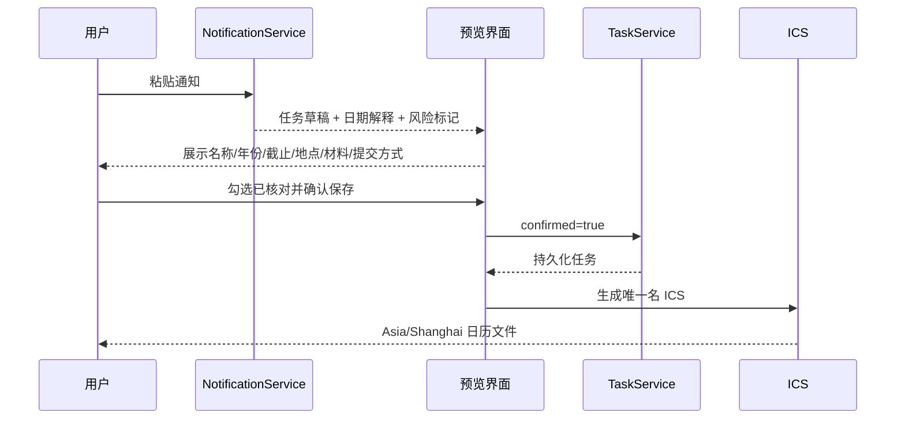

# Agent 工作流

## 意图路由

`Orchestrator` 同时使用语言模式分数、地点/饭堂/时间实体、当前校区上下文和可选外部分类器。每次结果包含意图、校区、置信度、理由和可显示的工具计划。

| 意图 | 典型问法 | 工具计划 |
|---|---|---|
| `campus_location_search` | “图书馆在哪里” | `search_locations` → `calculate_freshness` |
| `canteen_search` | “广州校本部有哪些饭堂” | `list_canteens` → `get_canteen_details` |
| `food_search` | “我想吃面” | 只查已核验档口 |
| `nearby_location_search` | “附近有快递站吗” | `find_nearby_locations` |
| `campus_navigation` | “去图书馆怎么走” | 查地点 → 生成导航链接 |
| `campus_data_freshness` | “数据最后什么时候核验” | 列出条目新鲜度 |
| `notification_to_tasks` | 带截止日期/材料/提交方式的通知 | 提取 → 预览，不创建 |
| `campus_process` | 校园卡、报修、请假等 | 只返回有可验证来源的流程 |
| `task_management` | “这周有什么没完成” | 按当前用户查本周任务 |

## 工具执行原则

1. 校园事实问题优先调用本地结构化服务。
2. 查询必须带校区；没有校区时先要求指定，不合并三校结果。
3. 答案同时显示核验时间、来源和过期警告。
4. 食物搜索只返回已核验、非演示的档口；无数据时不生成餐品。
5. 具有写操作的任务创建只能由用户确认触发。
6. 日期默认以 `Asia/Shanghai` 解析。缺年且当年候选日期已过时，推到下一年但标记必须确认。

## 通知到任务闭环

用户可在任务中心查全部/本周/过期任务，标记完成或重新打开。所有查询和更新都同时校验 `task_id` 和 `user_id`。
