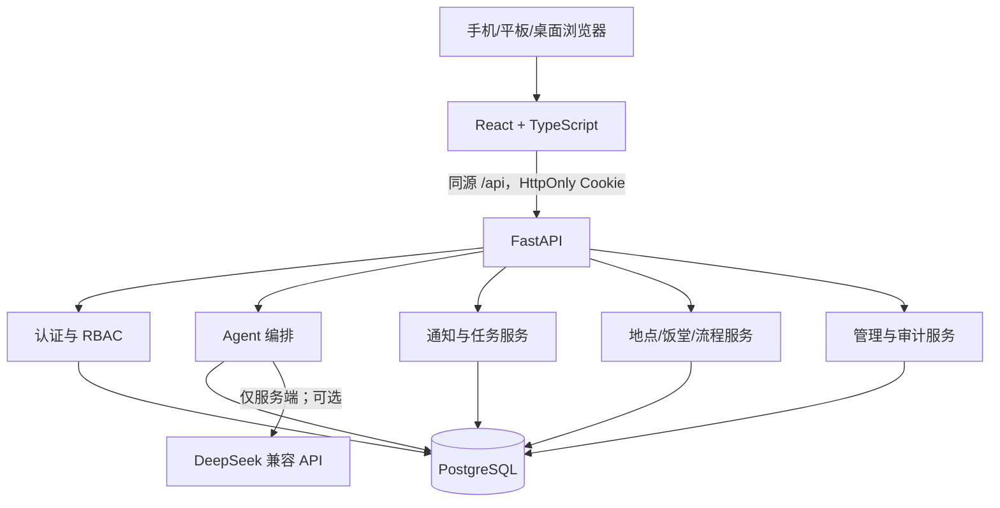

# 系统架构

## 请求路径

Nginx 承载静态前端并把 `/api/` 代理到 FastAPI，因此 Docker 默认是同源 Cookie。页面不直连数据库；Agent 也不能绕过服务层修改数据。

## 模块边界

- `frontend/src/pages`：路由页面，只通过 `api.ts` 请求后端。
- `backend/app/api`：HTTP、校验、状态码、身份依赖。
- `backend/app/services`：Agent、通知、时间、ICS、种子数据等业务规则。
- `backend/app/models`：SQLAlchemy 实体与关系。
- `backend/app/schemas`：Pydantic 输入输出边界。
- `backend/migrations`：唯一正式表结构演进路径。

## 认证

登录后由后端设置短期 Access Cookie 和限定在 `/api/auth` 的 Refresh Cookie。Refresh Token 数据库只保存 SHA-256 哈希，并在刷新时轮换。前端不使用 `localStorage` 保存认证凭据。普通用户和管理员权限在前后端都判断，但安全边界始终是后端 RBAC。

## Agent

正常路径：用户/校区上下文 → `Asia/Shanghai` 当前时间 → LLM 结构化意图 → Pydantic 验证 → 数据库工具 → 结果校验 → 保存对话 → 结构化响应。LLM 不可用时采用显式 `degraded=true` 的规则分类。涉及校园事实时只访问数据库，无法确认就返回无数据。

## 数据可信度

地点、饭堂、档口和流程保留来源、核验状态、核验时间、可信度、启用状态等字段。管理员标记 `verified` 时必须提供证据，后台写入 `verification_records` 与 `admin_audit_logs`。旧数据不会因年份变化自动升级为最新。

## 部署拓扑

本地/单机：Nginx + FastAPI + PostgreSQL 三容器。托管平台：Vercel 可部署前端，Render/Railway 部署 FastAPI，Neon/Supabase 提供 PostgreSQL；跨域时必须正确配置 HTTPS Cookie 和 CORS。生产 Secrets 不进入镜像或仓库。
