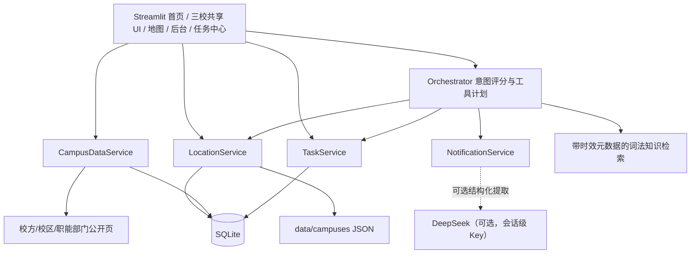

# 系统架构

## 设计目标

系统以“本地结构化工具先于大模型”为核心。地点、饭堂、档口、来源、任务状态和时间解析由可测试服务决定；模型只能帮助分类或提取，不能绕过来源与核验状态编造校园事实。

## 分层

### 核心层

- `core/time_service.py`：`Asia/Shanghai` 时间、相对日期、缺失年份风险与新鲜度。所有入口都可注入 `reference_time` 做确定性测试。
- `core/models.py`：地点、饭堂档口、来源、新鲜度和任务的类型模型。
- `core/database.py`：SQLite schema、事务、外键与查询帮助器。
- `core/orchestrator.py`：结合语言模式、实体、当前校区和可选分类器的混合路由。

### 服务层

- `LocationService`：强制校区过滤、别名搜索、饭堂/档口、附近距离、导航、纠错、导入、逻辑停用、核验和版本回滚。
- `CampusDataService`：官方来源配置、缓存、重试、超时、差异检测和失败隔离。抓取内容不会直接改写已核验地点。
- `NotificationService`：规则提取为默认降级，有显式 Key 时才调用模型。输出永远是无副作用草稿。
- `TaskService`：按 `user_id` 隔离持久化任务，只接受显式确认创建，支持本周、过期、完成与重开。

### 展示层

三个校区脚本只调用 `ui/campus_page.py` 的共享渲染函数。地图筛选和营业时间判断放在 `ui/map_helpers.py` 的纯函数中，可在没有 Streamlit 运行时直接测试。

## 降级策略

- 无 API Key：地图、结构化查询、规则通知提取、任务、ICS 和后台正常运行。
- 无地图 Key：对已核验 GPS 使用 Streamlit 底图；其他地点使用 0–1 示意坐标，并显式标记精度。
- 官方源刷新失败：保留上次内容和哈希，单源错误不终止批次。
- 无当日菜单：返回“没有可靠当日数据”和最近核验档口，不生成菜单。
